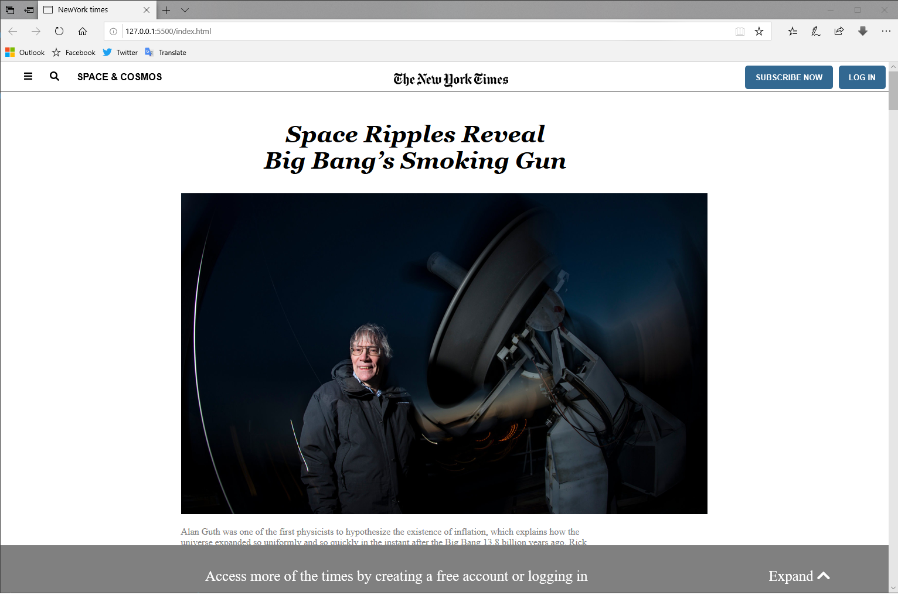

# The New York Times Page Clone

This project is part of the Microverse program in which we have created a clone page of The New York Times article.

## Built With

- HTML
- CSS

## Live Demo

[Live Demo Link](https://livedemo.com)

## Authors

👤 **Ezeokwelume Kosisochukwu Stephen**

- Github: [@KossySteve](https://github.com/KossySteve)
- Twitter: [@EzeSteve3](https://twitter.com/EzeSteve3/)
- Linkedin: [linkedin](https://www.linkedin.com/in/steve-ez-b090ba198/)

👤 **Manuel Muhun**

- Github: [@meme-es](https://github.com/githubhandle)
- Twitter: [@meme_es](https://twitter.com/meme_es)
- Linkedin: [linkedin](https://www.linkedin.com/in/manuel-elias-b289a638/)

## 🤝 Contributing

Contributions, issues and feature requests are welcome!

Feel free to check the [issues page](issues/).

## Show your support

Give a ⭐️ if you like this project!
